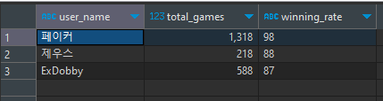

opez
=============

###### opez의 ERD 다이어그램

# 문제
### 1) 각챔프별 모든 장인들의 챔피언 이름과 평균 판수 조회하시오.
예시)  

### 2) 점멸을 들지 않는 장인의 닉네임과 스펠 모두 조회해주시오.
예시)  

### 3) 승률이 가장 높은 장인 3명의 닉네임 판수 승률을 승률 내림차순으로 조회해주시오.
예시)  

### 4) 모든 유저 중 장인을 제외한 일반 유저의 이름과 티어를 조회해주시오.
예시)  

### 5) 다중 join을 이용하여 판수가 500판 이상이고 1000판 이하인 장인의 닉네임, 티어, 판수, 핵심 룬, 스펠, 첫 코어 아이템의 이름, 스킬 선마 순서를 판수가 많은 순서대로 조회하시오.

예시)
